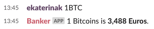

# Introduction

## Welcome

Welcome to the Programming for non-programmers tutorial! We are happy to see you here :\) In this tutorial, we will take you on a journey under the hood of web technologies, offering you a glimpse of all the bits and pieces that need to come together to make the web work as we know it.

As with all unknown things, this is going to be an adventure - but no worries, since you already worked up the courage to be here, you'll be just fine :\)


This workshop based on [Django Girls Tutorial](https://tutorial.djangogirls.org/en/)


## Introduction

Have you ever felt that the world is more and more about technology to which you cannot \(yet\) relate? Have you ever wondered how to create a program but have never had enough motivation to start? Have you ever thought that the software world is too complicated for you to even try doing something on your own?

Well, we have good news for you! Programming is not as hard as it seems and we want to show you how fun it can be.

This tutorial _will not magically turn you into a programmer_. If you want to be good at it, you need months or even years of learning and practice. But we want to show you that programming is not as complicated as it seems. We will try to explain different bits and pieces as well as we can, so you will not feel intimidated by technology.

We hope that we'll be able to make you love technology as much as we do!

### What will you learn during the tutorial? 

Once you've finished the tutorial, you will have a small working web application: your slack chat bot. This bot will receive BTC amount and answer with EUR, just like that:

