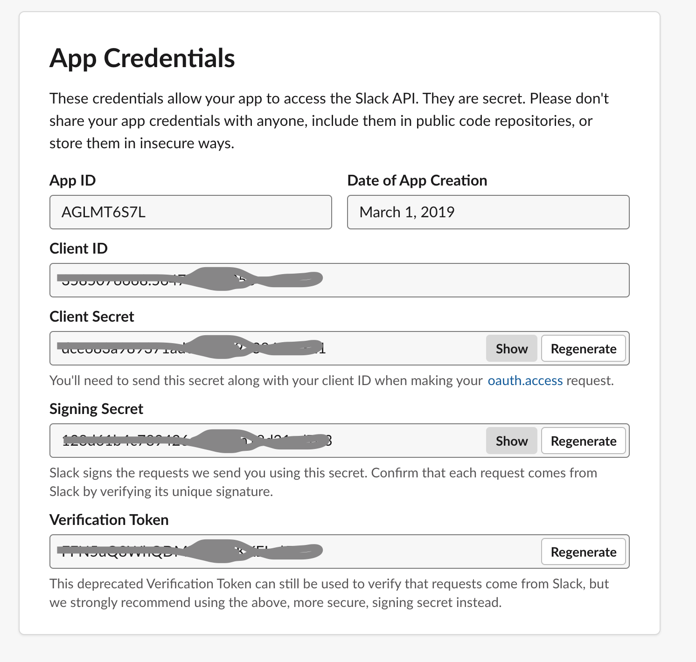
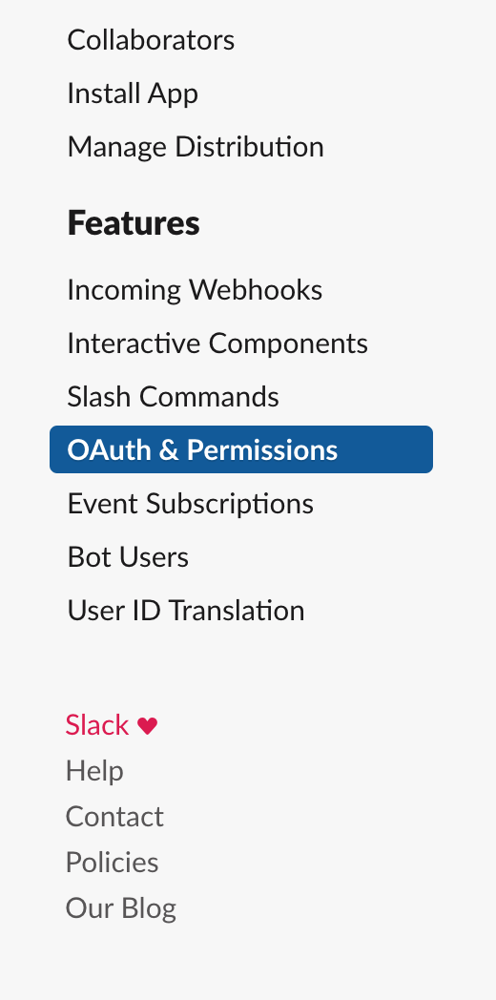
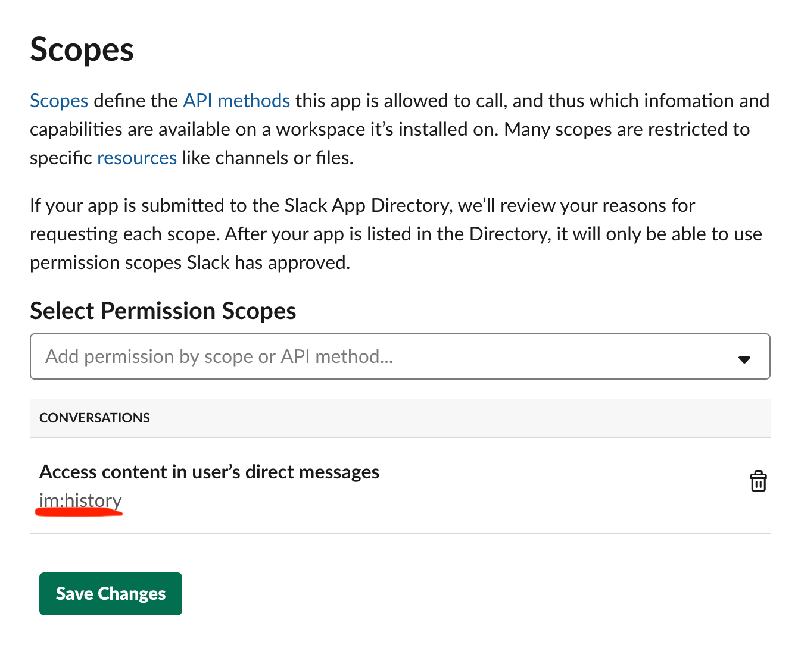
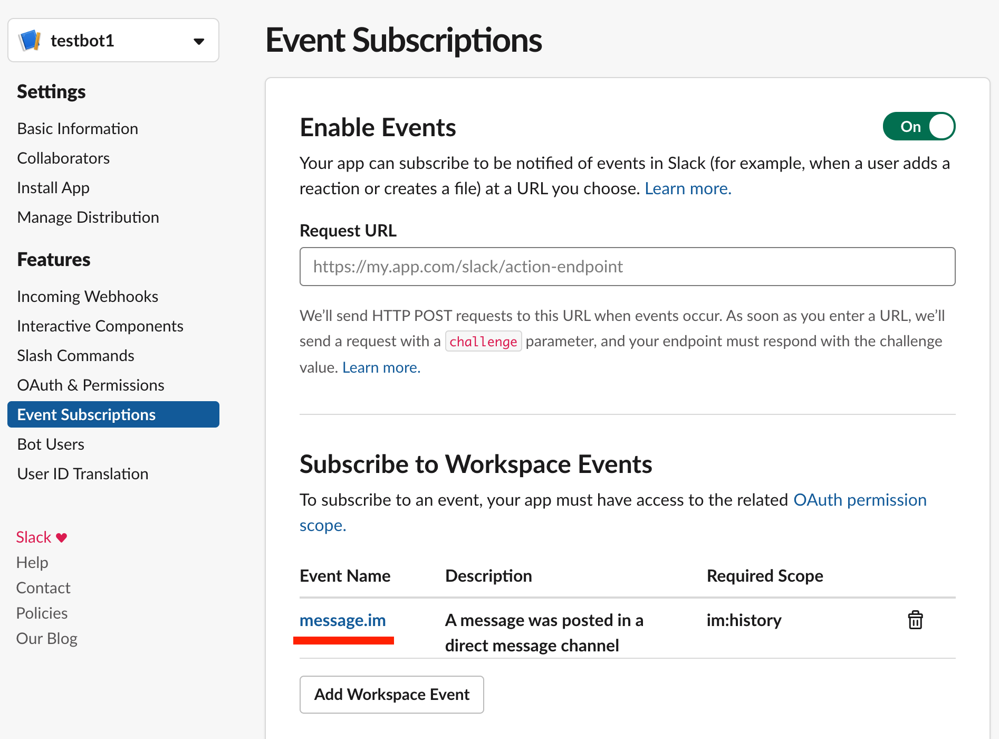
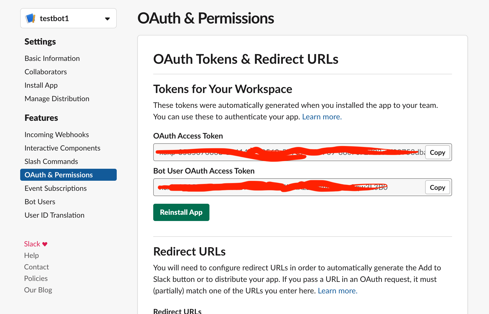

# Configuring Slack

## Short overview

On this step, we will configure Slack to be able to serve our new bot with messages. This configuration step is needed because or Slack bot going to receive data from Slack.

## Create Slack App

Our bot will be a Slack app. Slack apps allow you to add more functionality into Slack workspace.

To create new Slack bot, go to [this page](https://api.slack.com/apps?new_app=1) and set your app name to {{your-name}}-app. For example, if your name is Andrey, set it to "andrey-app"

After creating the new app, you should be able to see page like that:

### Add Slack application permissions

In order to be able to receive data from Slack, you need to add some permissions to the new app.

Choose OAuth and Permissions menu item:

Add this permission:

This will allow bot to read messages, addressed to him.

### Events subscription

Adding a subscription will allow new bot to receive information from Slack. Add "message.im" subscription \(our bot will reply to direct messages\)

### Add bot user

To be able to interact with users, your app should have bot user. Let's add it:

### Save bot token

You'll need "Bot User OAuth Access Token" very soon, so either copy-paste it somewhere, or just memorize where to find it :\)

