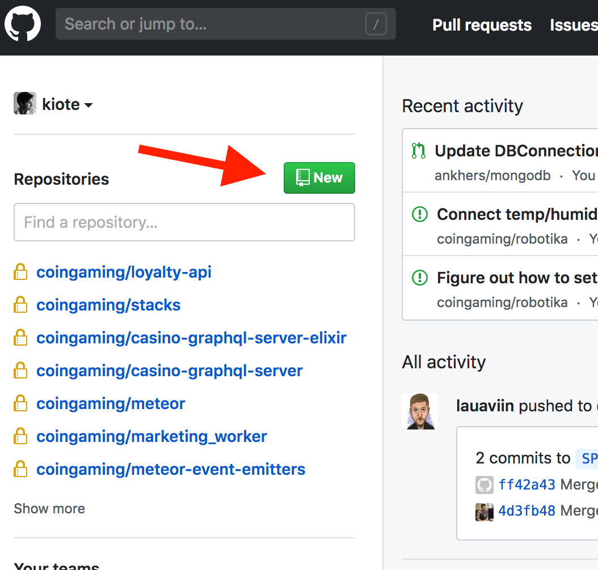
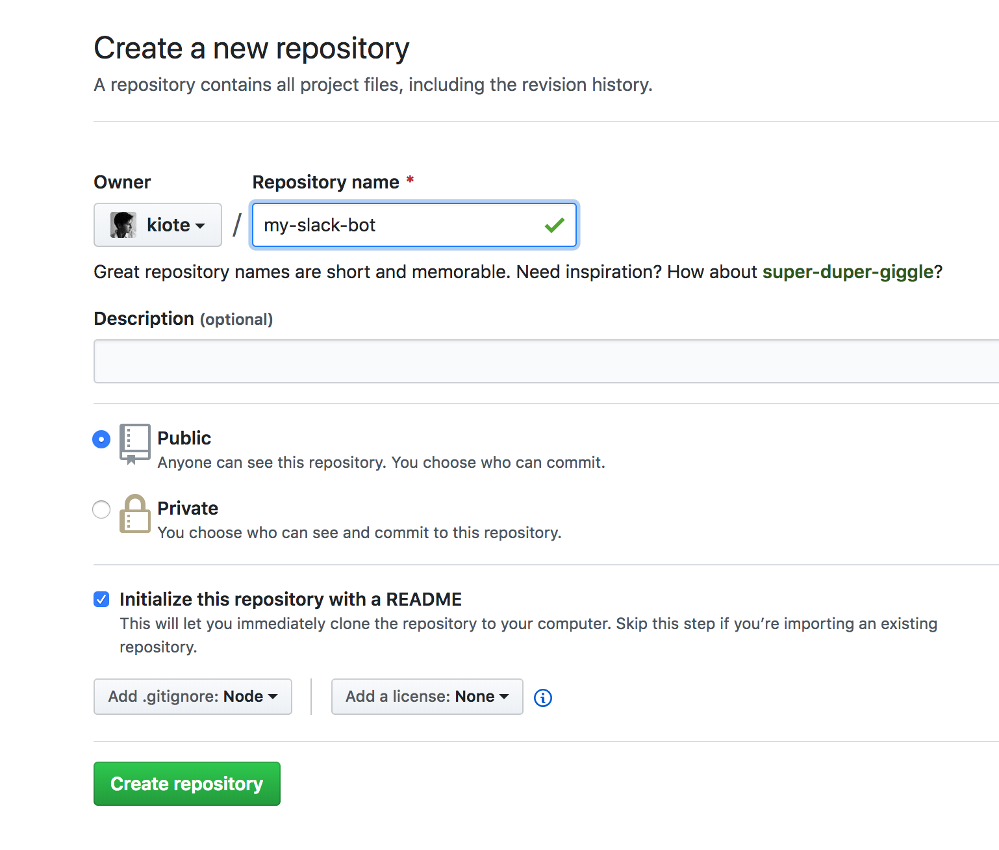

# Github project configuration

## Short overview

During this step, we will create and store out bot's source code \(program!\) in the github. That is needed for several reasons: 

* you can easily access this code any time you need from different computes \(since it's going to be published in the internet\)
* you can track the changes of your code \(git does history saving for you\), so you don't need to be afraid to make any changes to your code
* you can share your code with other developers so they will be able to help you to identify a problem remotely, if needed.

## Initialise the project

1. got to github.com and login
2. Click "new" 

3. Choose the repository name, it doesn't really matter but would be better if you can use something self-describing, like "my-first-slack-bot" for example

4. Click "initialise repository with a README". It is always a good idea to have a README in your project, with a short explanation what project does and how to use it

5. Click "Add .gitignore" and type "Node" in a field which will appear. This step is needed to not add any non-necessary files, which NodeJS generates, to git.

You should see something similar to this screenshot:

If all set, click "Create repository"

