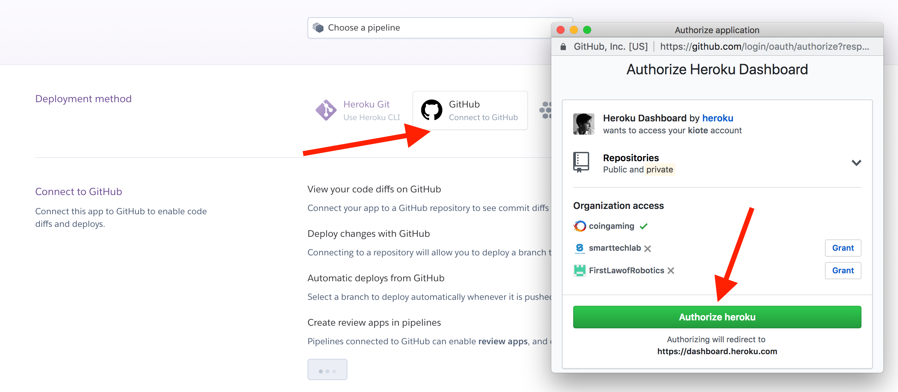
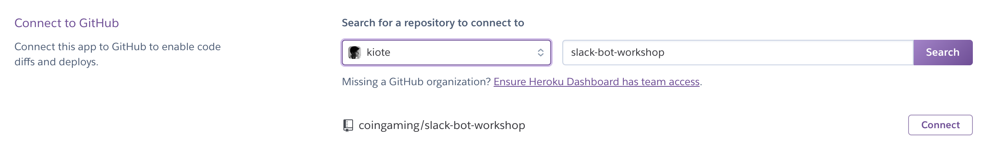
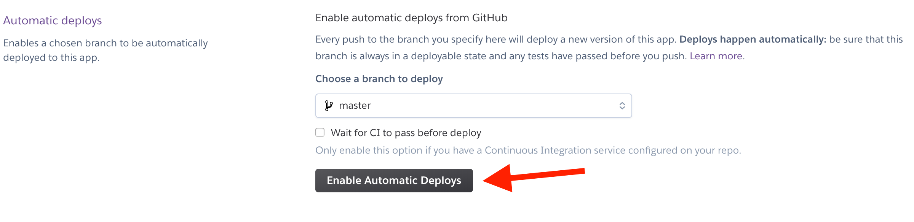
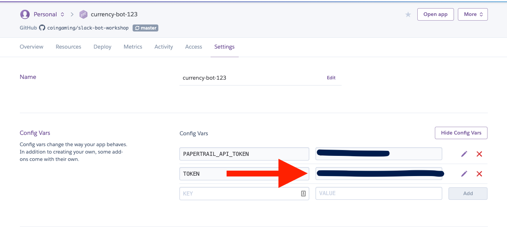

# Heroku setup

## Short overview

Heroku is a hosting for your service. You need to use a hosting, since your bot is going to be online even if your computer is off, and you are sleeping and on vacation.

## Create new application

1. Login to heroku \(you should have login and password from Installation step\)
2. Create new app: [https://dashboard.heroku.com/new-app](https://dashboard.heroku.com/new-app)
3. Choose app name \(anything works here, doesn't really matter\), I used currency-bot-123 for this example 
4. Choose region: Europe
5. Click "Create new app"

## Deployment configuration

You'll see new application configuration page with a lot of details, but fear not, we'll drag you through!

1. For "Deployment method" click on "Github"
2. New window with "Authorize application" title will appear, click "Authorize heroku"

## Connect with repository

You'll see "Connect to Github" dialog, enter your repository name you've created on step "Github project configuration". Click search. When you see that repository was found, click "Connect"

## Enabling automatic deploys

In real life, before deploy to live server, your application should go through auto- and manual- tests phases, but for sake to be able to finish this tutorial, we will simplify this process.

In the "Automatic deploys" section make sure that you have "master" branch selected and click "Enable Automatic Deploys":

## Add bot token

To connect our hosting with slack app, one of the things we need to do is to add token we found on the step [https://kiote1.gitbook.io/slackbotworkshop/configuring-slack\#save-bot-token](https://kiote1.gitbook.io/slackbotworkshop/configuring-slack#save-bot-token) 

To do that, go to [https://dashboard.heroku.com/apps/](https://dashboard.heroku.com/apps/), choose your app name and go to settings. Add a new field, name it "TOKEN" and paste the value into the second field:

We are done here! Lets go to the next step:

