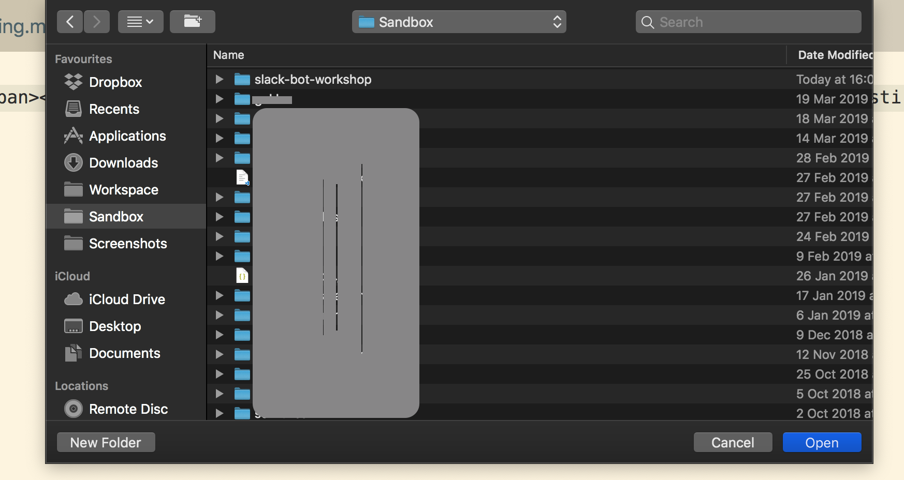
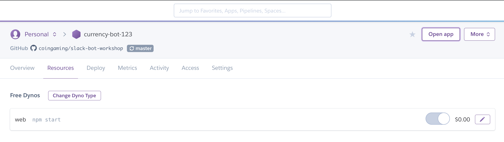
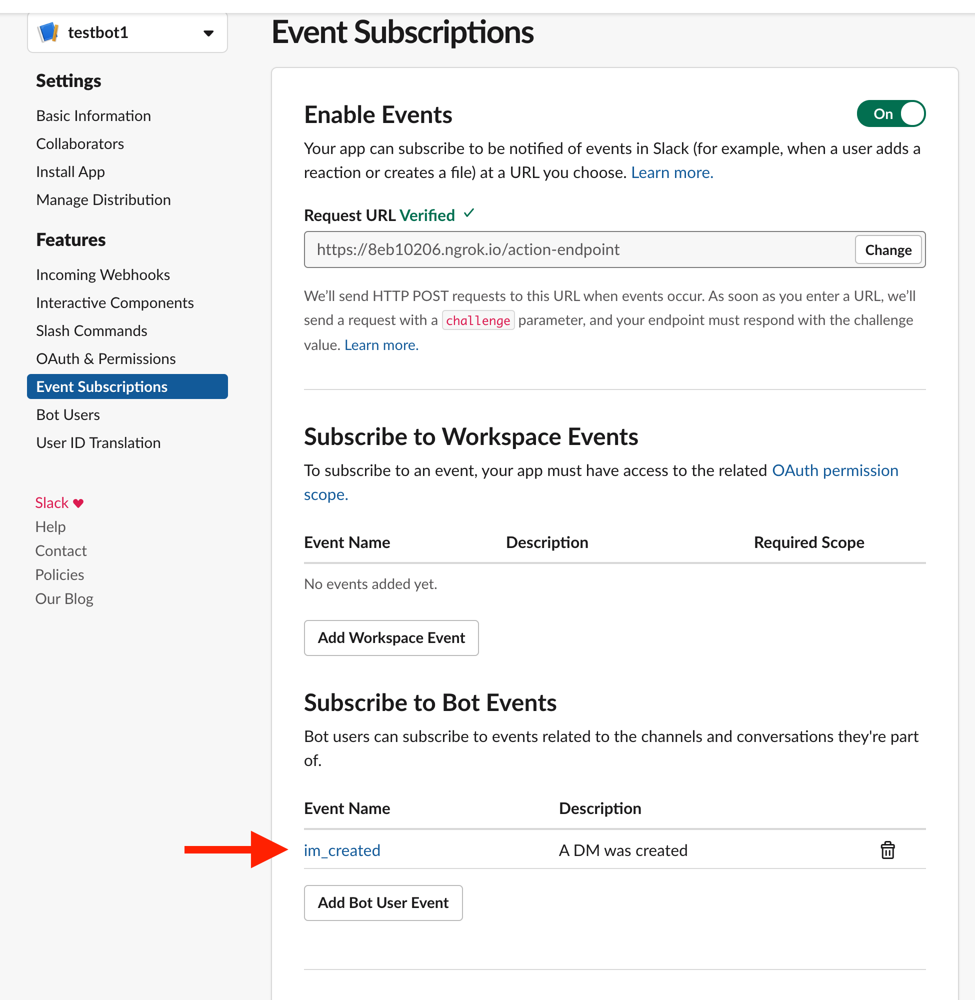

# Time to code!

## Short overview

During this step you'll be coding bot's "brain" which will be able to get the command from slack and reply with exchange rate.


## Init npm project

You should have npm installed on your machine after Installation step. So you need to open command line \(it should be still opened since the step Github project configuration\) and type:

```text
npm init
```

this command will start to ask you questions, but it is fine for now just to hit Enter to every question :\) When you reached the point with a question "Is this OK?" type "yes" and hit Enter.

After that, run 

```text
npm install
```

with this two commands we've initialised empty project, which does nothing so far.

## Create main program

### Create empty file

From the same command line, run



```text
touch main.js
```



```text
copy NUL main.js
```



This command will create new empty file in the same folder.

Now you need to open your code editor you've installed during the installation step and make it to open the folder, where your fresh npm project is.

For that, open code editor's menu File -&gt; open and find a folder, for me it's here \(Snadbox/slack-bot-workshop\):



Click on "main.js" file to start editing it in your code editor.

### Add first lines

Type this into your main.js:

```text
const express = require('express');
const app = express();
const bodyParser = require('body-parser');

app.use(bodyParser.json());
```

This three lines declares that you are going to use express server and body-parser. These are both programmes written by other developers and we just going to use them.

You can find out more if you google "express nodejs" and "body-parser nodejs"

After that, add these lines to your main.js:

```text
const listener = app.listen(process.env.PORT || '3000', function () {
  console.log('Your app is listening on port ' + listener.address().port);
});
```

These lines are saying that your application will be a web application \(so it would be able to operate through the internet\).

### Trying to run for the first time!

Now save the file and go back to command line, enter this command there:

```text
node main.js
```

this command suppose to run your program, but instead you should see this error:

```text
module.js:471
    throw err;
    ^

Error: Cannot find module 'express'
    at Function.Module._resolveFilename (module.js:469:15)
    at Function.Module._load (module.js:417:25)
    at Module.require (module.js:497:17)
    at require (internal/module.js:20:19)
    at Object.<anonymous> (/Users/kiote/Sandbox/slack-bot-workshop/main.js:5:17)
    at Module._compile (module.js:570:32)
    at Object.Module._extensions..js (module.js:579:10)
    at Module.load (module.js:487:32)
    at tryModuleLoad (module.js:446:12)
    at Function.Module._load (module.js:438:3)
```

Once again, do not be scared, we going to fix it right away!

This error says, that you declared the module "express", but you don't have it anywhere, so it's impossible to use it. To fix it, you need to install it \(in the command line\):

```text
npm install express -s
npm install request -s
```

Try to run your program again \(in command line\):

```text
node main.js
```

This time you should see message like: "Your app is listening on port 3000"

Congratulations! There is still way to go, but you are on the right path

### Adding changes to git

In command line, stop your app with hitting Ctrl+c on your keyboard. Now you need to add your first changes in this program to git:

```text
git add .
git commit -am 'empty program'
git push
```


We are going to refer this part very often, so when you see "add your changes to git" sentence, please execute the same commands in command line. You need to change text 'empty program' to whatever describes you are doing at the moment, for example 'new endpoint'


### Adding the first page

At this point, our program should be already deployed to heroku, since we've configured autodeploy from master branch on "Heroku setup" step. But we have not that many ways to realise if it's actually running there. Just to be able to check that, we are going to add web page with short text.

After first three lines add these lines to your main.js file:

```text
app.get('/', function (req, res) {
    const reply = {
        "status": "ok"
    };
    res.json(reply);
});
```

With this we are announcing that when user opens "/" \(or "root"\) of our program, he or she will see some text saying "status is ok".

#### Add changes to git

In command line:

```text
git add .
git commit -am 'add healthcheck'
git push
```

#### Check the health of your application

in command line, run 

```text
node main.js
```

in browser, open: "localhost:3000/"

#### First page on heroku

In order to be able to see your first page on heroku, you should add this line to "package.json" file \(open it in your code editor\):

```text
"start": "node main.js"
```

whole file should look like that now \(you only need to add 8th line, the rest you should have generated for you\):

```text
{
  "name": "slack-bot-workshop",
  "version": "1.0.0",
  "description": "",
  "main": "index.js",
  "scripts": {
    "test": "echo \"Error: no test specified\" && exit 1",
    "start": "node main.js" # <--- add this line
  },
  "repository": {
    "type": "git",
    "url": "git+https://github.com/coingaming/slack-bot-workshop.git"
  },
  "author": "",
  "license": "ISC",
  "bugs": {
    "url": "https://github.com/coingaming/slack-bot-workshop/issues"
  },
  "homepage": "https://github.com/coingaming/slack-bot-workshop#readme",
  "dependencies": {
    "express": "^4.16.4"
  }
}

```

Commit your changes to git again, as described here:  [https://kiote1.gitbook.io/slackbotworkshop/time-to-code\#add-changes-to-git](https://kiote1.gitbook.io/slackbotworkshop/time-to-code#add-changes-to-git), but change the commit message to "add start script"

#### Check the health

Now go back to your heroku account, open just created app and find "Open app" button:



your app will be opened in a new tab, and you should be able to see "{"status": "ok"}"

### Create slack endpoint

Now we need to create a part of the program, which will be interacting with slack. For that, we need a new endpoint, let's call it "action-endpoint". Add these lines after "/" endpoint definition:

```text
app.post('/action-endpoint', function (req, res) {
  const challange = req.body.challange;
  const reply = {
      "challange": challange
  };
  res.json(reply);
});
```

#### Connect this changes to Slack

Add your changes to git. Now open in browser slack settings page and add your application url and new endpoint here \(request URL field\), also add "subscribe to bot events": "im\_created". This will allow new bot to read your messages and reply.



#### Change endpoint code

It might be a bit confusing, but no worries, it is totally fine to be confused. This part is an essence of our bot functionality, so it takes a bit to wrap your head around it.

```text
app.post('/action-endpoint', function (req, res) {
  const challenge = req.body.challenge; // this challenge is needed to ensure slack that our bot works
  
  const reply = {
      "challenge": challenge
  };

  const headers = {
    'Content-type': 'application/json',
    'Authorization': `Bearer ${process.env.TOKEN}` // this token you need to set on he
  }

  // console.log(req.body.event);

  if (req.body.event.subtype != 'bot_message') { // se we won't reply to ourselves...
    const body = {
      'channel': req.body.event.channel,
      'text': 'Hello there'
    }

    const options = {
      url:   'https://slack.com/api/chat.postMessage',
      method: 'POST',
      headers,
      body:  JSON.stringify(body)
    };

    request.post(options, function(err, res, body) {
      if (err) {
        console.log(err);
      }
    })
  }

  res.json(reply);
});
```

### Get currency rate

So far we've achieved quite a lot, but our bot is not doing much, it is just replying "hello". Let's teach it how to reply with current currency rate \(EUR -&gt; BTC\).

To do that, we will use open API from CoinDesk: [https://api.coindesk.com/v1/bpi/currentprice/EUR.json](https://api.coindesk.com/v1/bpi/currentprice/EUR.json)

Change the code inside "if req.body..." \(lines 15-33 from code above should be replaced with that\):

```text
  if (req.body.event.subtype != 'bot_message') { // se we won't reply to ourselves...
    request.get('https://api.coindesk.com/v1/bpi/currentprice/EUR.json', function(err, res, body) {
      if (err) {
        console.log(err);
      }
      else {
        const coindesk = JSON.parse(body);
        const rate = coindesk.bpi.EUR.rate;
        const reply = {
          'channel': req.body.event.channel,
          text: `Current BTC rate: ${rate} EUR per 1 BTC`
        }

        const options = {
          url:   'https://slack.com/api/chat.postMessage',
          method: 'POST',
          headers,
          body:  JSON.stringify(reply)
        };

        console.log(body);
    
        request.post(options, function(err, res, body) {
          if (err) {
            console.log(err);
          }
        });
      }
    });
  }
```

Add your changes to git.

## Result

After all these steps you should be able to see response from bot, doesn't matter what message you send, it will respond with current BTC rate. Very neat, isn't it? Congratulations, you made really great job following till the very last step!

## What's next

As a bonus step, you can modify the bot in a way, that it will be able to reply with amount of EUR in BTC you send it. 

For example, the dialog might look like this:

> you: 14 BTC
>
> bot: 14 BTC is 46 622 EUR

There is no limits for your own fantasy now! 

